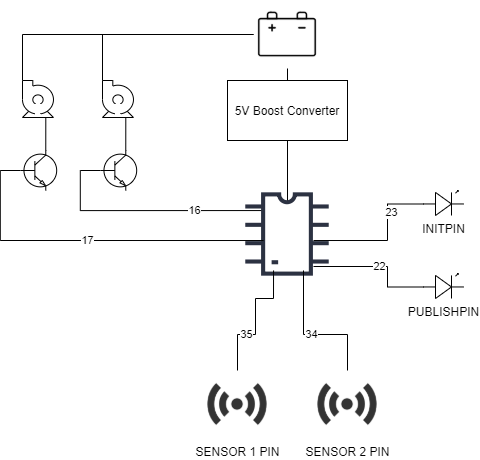

# Soil Moisture NodeMCU ESP32 Project

Soil Moisture project made with VSCode PlatformIO, configured for NodeMCU ESP32.

## Getting Started

Download project files. 
Install VSCode, add PlatformIO extension 
Create `include/secrets.h` file with necessary macros 
Create AWS Account with following resources: 

- AWS IoT Thing to publish/subscribe to topics
- DynamoDB Tables to upload sensor and battery data

## Hardware Requirements

Uses the following components:

- NodeMCU ESP32 Module
- Capacitive Soil Moisture Sensor x 2
- Mini submersible Water Pump x 2
- BJT Transistors x 2
- Lithium Ion Battery
- 5V Boost Converter
- LED x 2

## Deployment

Build and Upload project to ESP32 Module
